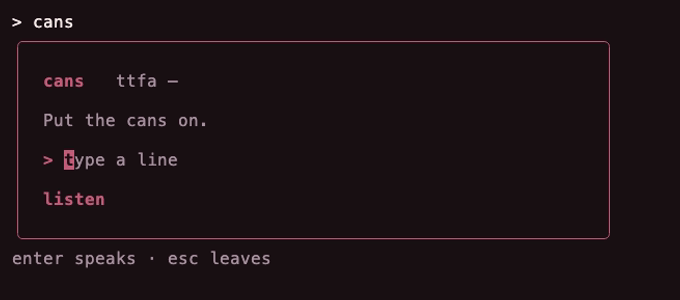

# cans

**Put the cans on.**

<p align="center">
  
  
</p>

<p align="center">
  
</p>

Type a line. I say it. Local. Apple Silicon + MLX.

Default throat is mine. To pin someone else you need the wav **and** the words in it:

```text
cans keep take.wav -text "Just like that, feel the rhythm of my voice."
just run keep take.wav -- -text "Just like that, feel the rhythm of my voice."
```

The booth freezes that throat for the session.

```text
just run say "I'm already on the line."
just run booth
```

18+. I don't leave the machine.

Private. Not the sex booth.

---

Planned as a festival → [fest.build](https://fest.build)
